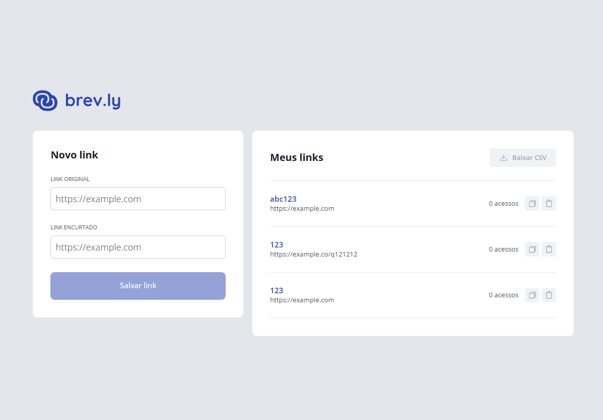

# URL Shortener — Encurtador de links

O objetivo deste projeto é facilitar o compartilhamento de endereços da internet por meio de links curtos e permitir que eles sejam gerenciados em uma única interface.



Este diretório contém o **frontend**, a parte visual da aplicação. A proposta inclui cadastrar links, consultar a quantidade de acessos, copiar e excluir links e exportar a lista em CSV.

**Estágio atual:** as telas estão em desenvolvimento e a listagem utiliza dados de exemplo. As ações de salvar, copiar, excluir, baixar CSV e redirecionar para o endereço original ainda não estão implementadas. Não há integração com uma API neste frontend.

## Tecnologias utilizadas

| Tecnologia | Papel no projeto |
| --- | --- |
| React 19 | Construção da interface com componentes reutilizáveis. |
| TypeScript 6 | Definição de tipos para dados e propriedades dos componentes. |
| React Router 8 | Organização das páginas e das rotas. |
| Tailwind CSS 4 | Estilização e adaptação do layout a diferentes tamanhos de tela. |
| Vite 8 | Servidor de desenvolvimento e ferramentas de build. |
| Phosphor Icons | Ícones dos botões e da listagem. |
| ESLint 10 | Análise do código para identificar problemas. |
| Node.js e npm | Execução das ferramentas e instalação das dependências. |

As versões completas estão no [package.json](./package.json) e no [package-lock.json](./package-lock.json).

## Prévia do projeto

> Espaço reservado para uma captura de tela ou um GIF da aplicação em execução.

Para adicionar a imagem, crie a pasta `docs/images`, salve o arquivo como `preview.png` e remova os marcadores de comentário da linha abaixo. Ajuste o texto alternativo para descrever a captura.

<!--  -->

## Como baixar e rodar

### 1. Prepare o ambiente

Você precisará de:

- **Node.js 24.x**, compatível com as dependências deste projeto.
- **npm**, instalado junto com o Node.js.
- **Git**, caso queira baixar pelo terminal. Também é possível baixar e extrair o ZIP do repositório.

Confira a instalação:

```bash
node --version
npm --version
git --version
```

### 2. Baixe o projeto

Substitua `URL_DO_REPOSITORIO` pelo endereço real do repositório:

```bash
git clone URL_DO_REPOSITORIO
```

Entre na pasta deste frontend, `web/url-shortener`, dentro do projeto baixado. Ela contém `package.json` e `vite.config.ts`.

Se a pasta criada ao baixar o repositório se chamar `url-shortener`, use:

```bash
cd url-shortener/web/url-shortener
```

### 3. Instale as dependências

Na pasta do frontend, execute:

```bash
npm ci
```

Esse comando instala as versões registradas no `package-lock.json`, mantendo a instalação consistente entre ambientes.

### 4. Inicie a aplicação

```bash
npm run dev
```

Abra no navegador o endereço informado pelo terminal, normalmente `http://localhost:5173`. Se essa porta estiver ocupada, utilize a porta exibida ao iniciar o servidor.

Para encerrar o servidor, pressione `Ctrl+C` no terminal.

**Variáveis de ambiente:** o arquivo `.env.example` está vazio. O código atual não exige configuração de variáveis nem um backend para visualizar as telas.

**Windows/PowerShell:** se aparecer um erro informando que a execução de `npm.ps1` está desabilitada, use `npm.cmd` no lugar de `npm`, por exemplo: `npm.cmd ci` e `npm.cmd run dev`.

### Páginas disponíveis

| Caminho | O que você encontra |
| --- | --- |
| `/` | Formulário de novo link e listagem com dados de exemplo. |
| `/redirect/abc123` | Tela de redirecionamento; `abc123` é um identificador de exemplo. O redirecionamento real ainda está pendente. |
| Qualquer caminho não cadastrado | Tela de link não encontrado. |

## Principais bibliotecas e documentação

| Biblioteca | Como é utilizada | Documentação |
| --- | --- | --- |
| **React e React DOM** | Criam e renderizam os componentes da interface. O hook `useState` mantém a lista de exemplo em `LinkList.tsx`. | [Aprenda React](https://react.dev/learn) |
| **React Router** | Define as rotas em `app/routes.tsx`, exibe as páginas dentro do layout principal e disponibiliza o parâmetro `urlId` à página de redirecionamento. O pacote `@react-router/dev` integra o roteamento ao Vite. | [Rotas no React Router](https://reactrouter.com/start/framework/routing) |
| **Tailwind CSS** | Aplica estilos por meio de classes como `flex`, `gap-6` e `rounded-lg`. O tema está em `app/styles/global.css`, e `@tailwindcss/vite` integra a ferramenta ao Vite. | [Tailwind CSS com Vite](https://tailwindcss.com/docs/installation/using-vite) |
| **Phosphor Icons** | Fornece os ícones de copiar, excluir, baixar e representar links, importados de `@phosphor-icons/react`. | [Phosphor Icons para React](https://github.com/phosphor-icons/react) |

Consulte também a documentação das ferramentas de desenvolvimento: [TypeScript](https://www.typescriptlang.org/docs/), [Vite](https://vite.dev/guide/) e [ESLint](https://eslint.org/docs/latest/).

## Organização do código

```text
app/
├── assets/         # Logotipos e ilustrações
├── components/     # Botões, campos de entrada e lista de links
├── pages/          # Página inicial, redirecionamento e página de erro
├── styles/         # Estilos globais e tema do Tailwind CSS
├── root.tsx        # Estrutura HTML e layout principal
└── routes.tsx      # Configuração das rotas
public/             # Arquivos estáticos públicos
package.json        # Dependências e comandos do projeto
vite.config.ts      # Integrações do Vite com Tailwind e React Router
```

Para explorar o código, comece por `app/pages/HomePage.tsx` e depois leia os componentes utilizados por essa página. Os dados de exemplo estão em `app/components/LinkList.tsx`.

## Comandos disponíveis

| Comando | Finalidade |
| --- | --- |
| `npm run dev` | Inicia o servidor de desenvolvimento com React Router. |
| `npm run build` | Verifica os tipos com TypeScript e, se a verificação passar, executa o build com Vite. |
| `npm run lint` | Analisa o código com ESLint. |
| `npm run preview` | Executa a prévia do Vite; depende de um build gerado e de uma configuração compatível. |

Esses comandos refletem os scripts atuais do `package.json`. Use o modo de desenvolvimento descrito acima para conhecer a interface.
